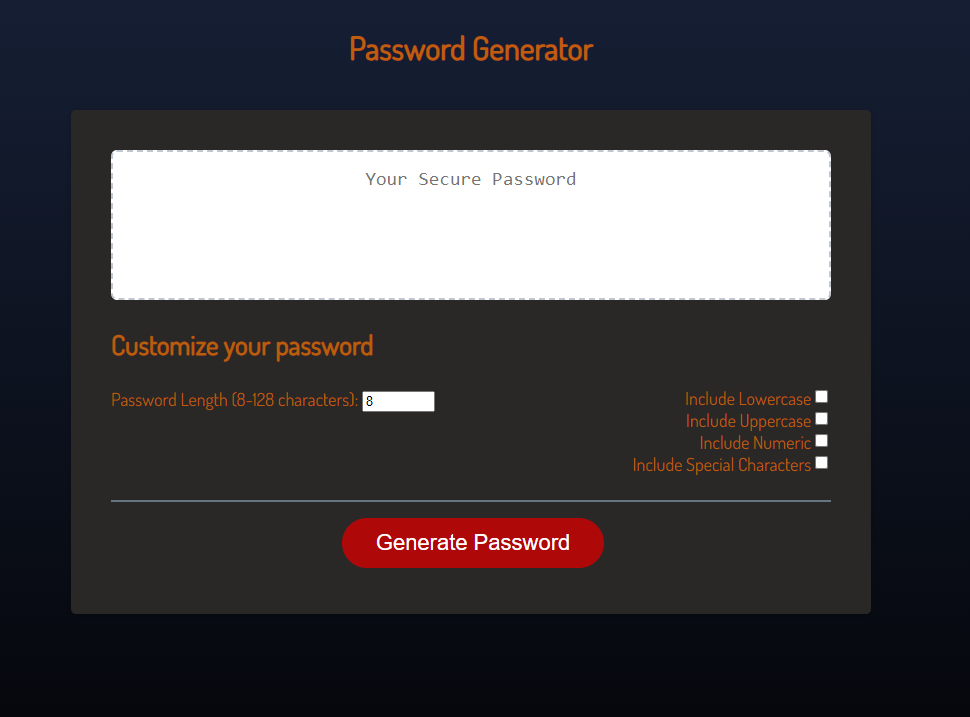

# Password Generator Challenge

## Description

The purpose of this project was to create a website with the capability of generating passwords for personal use.
Constructing this helped me learn more about arrays and functions

## Installation

1. Clone the repository to your local machine: https://github.com/Wolffkran/Wolffkrans_Module_1_Project_3_Assignment.git

2. Navigate to the project directory: cd Wolffkrans_Module_1_Project_3_Assignment

3. Open your web browser and visit `/Wolffkrans_Module_1_Project_3_Assignment/index.html` to view the application.

## Usage

## License

© 2023 edX Boot Camps LLC. Confidential and Proprietary. All Rights Reserved.